# CSE 232: Programming Assignment 1: Using command-line utilities for network debugging
### by Sidhartha Garg 2022499

**Q1. [1 + 1]**

**a) Learn to use the `ifconfig` command, and figure out the IP address of your network interface. Put a screenshot.**

**b) Go to the webpage [https://www.whatismyip.com](https://www.whatismyip.com) and find out what IP is shown for your machine. Are they identical or different? Why?**

**Ans 1. a)**
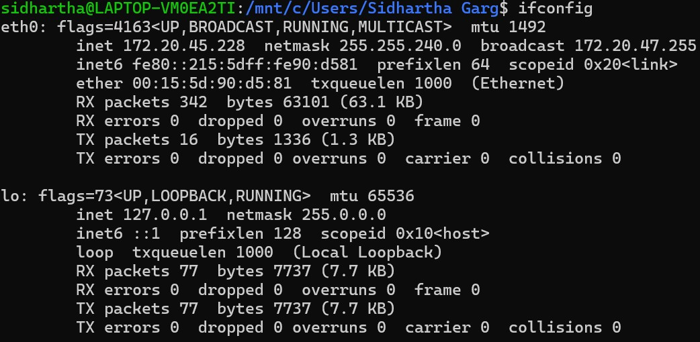
One can figure out the IP address from the `inet` in `eth0` network interface. Here, for the WSL, we see that the IPv4 IP address is `172.20.45.228`. Similarly, the IPv6 address can be found by observing the `inet6` in the `eth0` interface.

****this is for the wsl2 instance on my windows laptop**

**b)**
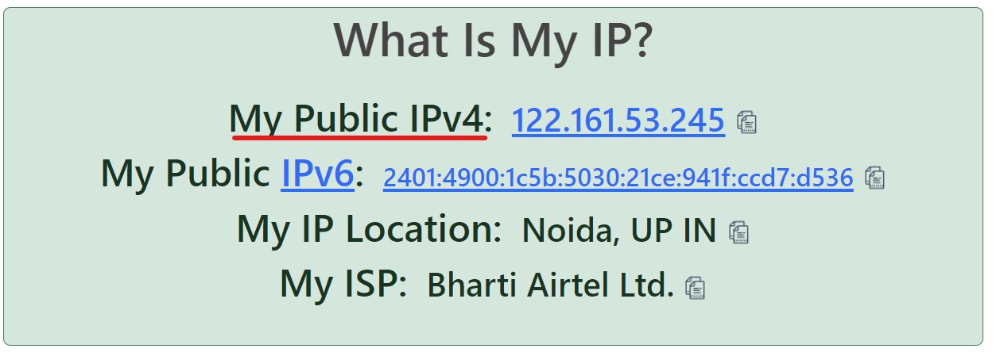
We can observe that the IP addresses are different because the IP address displayed by `ifconfig` corresponds to the local (private) IP address, while the IP address shown on the website represents the public IP address.

**Q.2. [1+1+1]**

**a) Change the IP address of your network interface using the command line. Put a
screenshot that shows the change. Revert to the original IP address.**

Ans2. a)
We can change the IP address of the network interface using the command `ifconfig <interface_name> <new_ip_address>`. As we can see sudo permission was required at my station before implementing this.

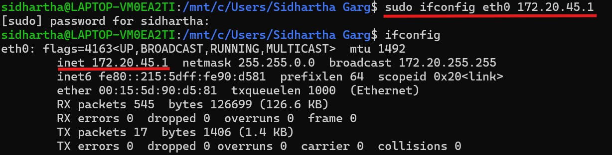

We can revert back to the original IP address now using the same command:

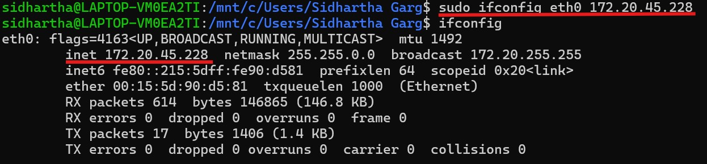

**Q.3. [4]**

**a) Use `netcat` to set up a TCP client/server connection between your VM and host machine. If you are not using a VM, you can set up the connection with localhost. Put a screenshot. [1+1]**

**b) Determine the state of this TCP connection(s) at the client node. Put a screenshot. [1+1]**

Ans3. a)
I establish a server-client connection between Windows and WSL using Telnet and Netcat:

On my WSL terminal:

1. Open the terminal.
2. Type `nc -l -p <PORT_NUMBER>` using the same an user defined port number.

On my Windows machine:

1. Open Command Prompt or PowerShell.
2. Type `telnet <WSL_IP_ADDRESS> <PORT_NUMBER>` (replacing the placeholders with my WSL IP and port) and press Enter to connect.

This sets up the connection, allowing me to communicate between Windows and WSL. When I’m finished, I close the Telnet connection and stop the Netcat server.

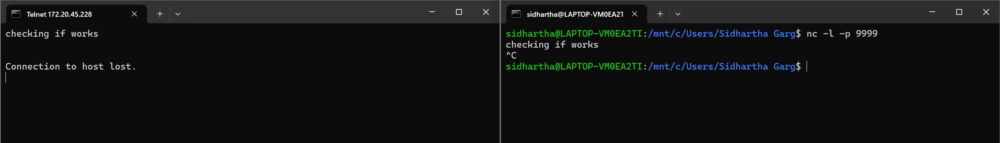

b) Using the `nc -l -p 9999` command on WSL to listen on port 9999 is actively reflected on the Windows host, as verified by the `netstat -an | findstr :9999` command. This demonstrates that the Netcat listener on WSL is successfully running and can be monitored from the Windows environment.
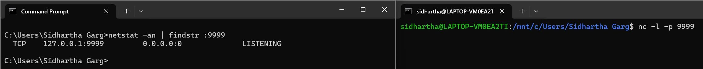
Further, connecting to the port using the WSL IP and port number will lead to establishing the connection.

**Q.4. nslookup ([2+1] + [1+1])**

**a) Get an authoritative result for “google.in” using nslookup. Put a screenshot. Explain how you did it.**

**b) Find out the time to live for any website on the local DNS. Put a screenshot. Explain in words (with unit) after how much time this entry would expire from the local DNS server.**

Ans4. a)
In the screenshot, I used the `nslookup` command to query DNS information for the domain `google.in`.

First Command: By running `nslookup -type=soa google.in`, I retrieved the Start of Authority (SOA) record for `google.in`, which provides details about the primary DNS server responsible for the domain, along with timing parameters like refresh, retry, expire, and minimum TTL.

Second Command: I then used `nslookup google.in ns1.google.com` to query the domain `google.in` specifically from the DNS server `ns1.google.com`, which is one of Google's authoritative name servers. By querying directly from an authoritative name server, I ensured that the response was authoritative, meaning it came directly from the source responsible for the domain.

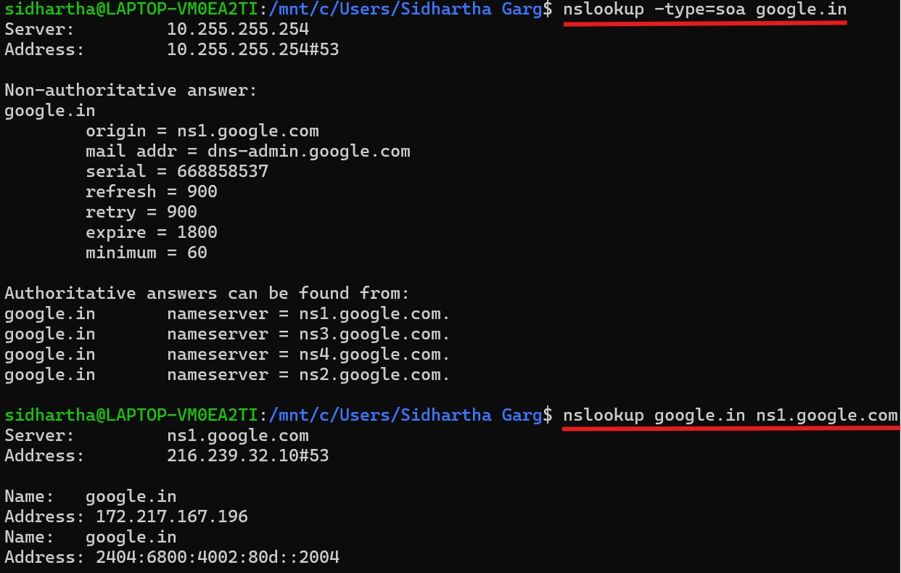

b)
- TTL stands for "Time to Live".
- It is a value that is used to determine the maximum amount of time the packet can remain in the network before it is discarded.
- We can find it using `nslookup -debug <domain_name>`.
- It is measured in **seconds**.

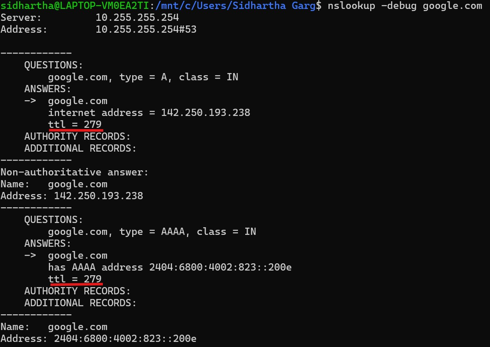

*Here, we see the ttl is 279 seconds.*

**Q.5. [13]**

**a) Run the command, traceroute google.in. How many intermediate hosts do you see?
What are the IP addresses? Compute the average latency to each intermediate host. Put
a screenshot. [1+2+1]
Note that some of the intermediate hosts might not be visible; their IP addresses
will come as `“***”`, ignore those hosts for this assignment.**

Ans) 
There are a total 8 intermediete hosts which can be seen in the picture, one of which is *** which will be excluded while doing the calculation of average latency.

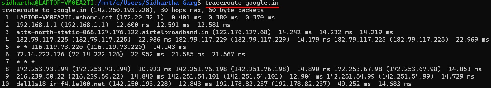
| Hop | IP Addresses | Average Latency (ms) |
| --- | ------------ | -------------------- |
| 2 | 192.168.1.1 | 12.502 |
| 3 | 122.176.127.68 | 14.231 |
| 4 | 182.79.117.225, 182.79.117.229 | 20.045 |
| 5 | 116.119.73.220 | 14.143 |
| 6 | 72.14.222.126 | 22.035 |
| 7 | * (No response) | - |
| 8 | 172.253.73.194, 142.251.76.198, 172.253.67.98 | 13.555 |
| 9 | 216.239.50.121, 142.251.54.101, 142.251.54.99 | 14.158 |

**b) Send 50 ping messages to google.in, Determine the average latency. Put a screenshot.**
**[1]**

Ans) We can do this by using the command `ping -c 50 google.in`. Here the flag `-c`, specifies the count of packets to be sent. In this case the number is 50.
As can be seen in the screenshot the average latency is `12.982 ms`.

**c) Add up the ping latency of all the intermediate hosts obtained in (a) and compare with (b). Are they matching, explain? [1+1]**

The sum of ping latency of all the intermediete hosts in (a) comes out to be `110.699 ms`. The average latency calculated in (b) is `12.982 ms`. 
We see both of them don't match and even the average of the sum in the first part which is `13.83 ms` doesn't match with the calculation of (b). Two reason which I think effect this:
- Network conditions can change between tests, affecting latency.
- Traceroute may take a different path than direct pings, potentially involving more hops or less optimal routes.

**d) Take the maximum ping latency amongst the intermediate hosts (in (a)) and compare it with (b). Are they matching, explain? [1+1]**

Ans) The maximum ping latency in (a) is `22.035 ms`. We see this does not match with the average calculated in (b) which is `12.982 ms`. 

This happens mainly becuase of network conditions which can fluctuate due to various factors like traffic congestion, routing changes, or temporary interference. 

**e) You may see multiple entries for a single hop while using the traceroute command. What do these entries mean? [1]**

Ans) Multiple hops typically indicates that the router at that hop has multiple routes to the destination and is performing per-packet load balancing.

**f) Send 50 ping messages to stanford.edu, Determine the average latency. Put a
screenshot.[1]**

Ans) We can see the average latency is `306.686 ms`.
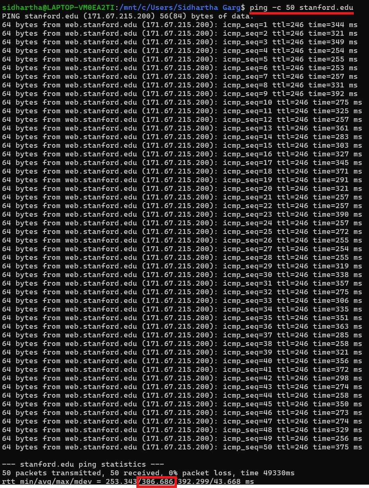

**g) Run the command, traceroute stanford.edu. Compare the number of hops between
google.in and stanford.edu (between the traceroute result of google.in and stanford.edu).[1]**

Ans) As we can see using the command `traceroute stanford.edu` gives the below picture which clearly shows **13 hops**.

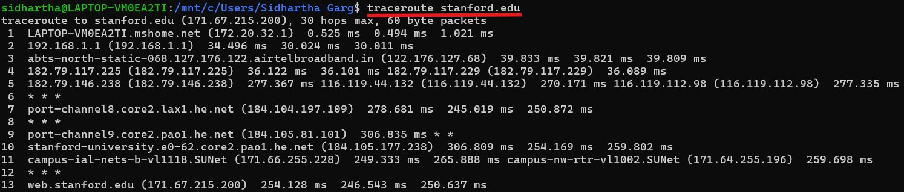
whereas, in 

we see **10 hops** while doing the command `traceroute google.in`.

**h) Can you explain the reason for the latency difference between google.in and
stanford.edu (see (b) & (f))? [1]**

Google.in: This domain is likely hosted on servers within India or nearby regions. Since the physical distance between my location and the server is relatively short, the time taken for data packets to travel back and forth (latency) is lower.

Stanford.edu: This domain is hosted on servers located at Stanford University in the United States. The physical distance between my location (in India) and Stanford's servers is much greater. This increased distance results in higher latency because data packets have to travel a longer distance, which takes more time.

**Q.6.[2+1] Make your ping command fail for 127.0.0.1 (with 100% packet loss). Explain how you do it. Put a screenshot that it failed.**

We can make the ping command fail for the 127.0.0.1 (localhost) by simply downing the lo interface, which is the loop back interface. We can do this by using the command `sudo ifconfig lo down`.  

Now when we use `ping 127.0.0.1` we see that 100 % loss of packets as we downed lo.
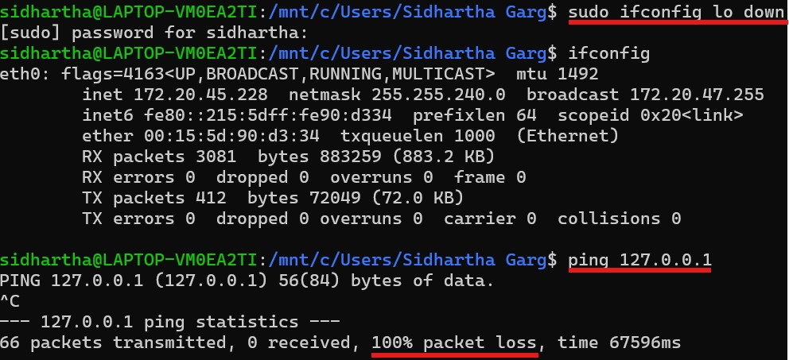
